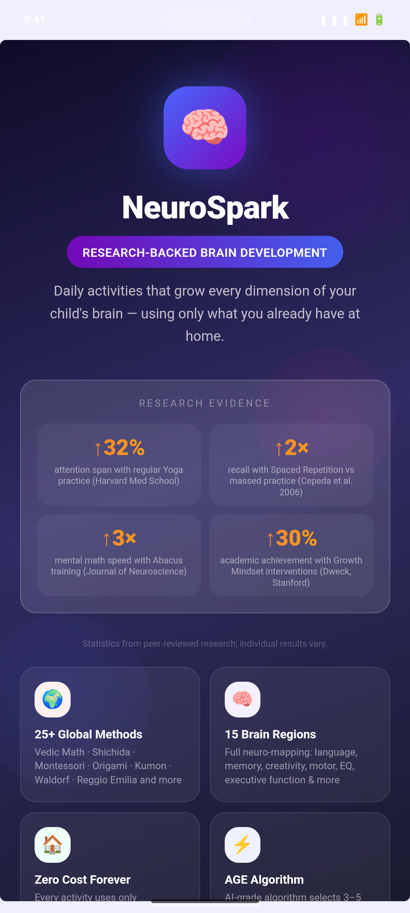
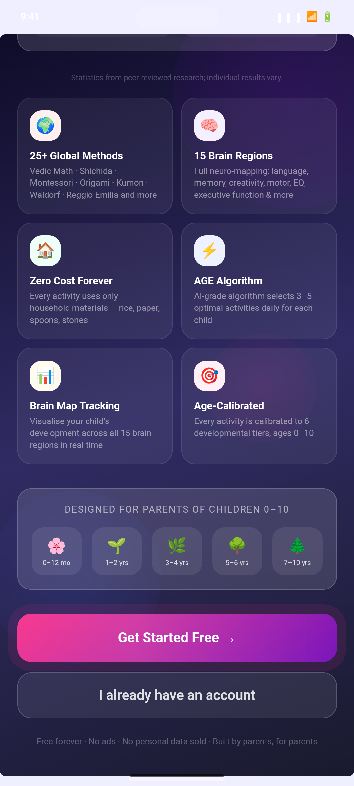
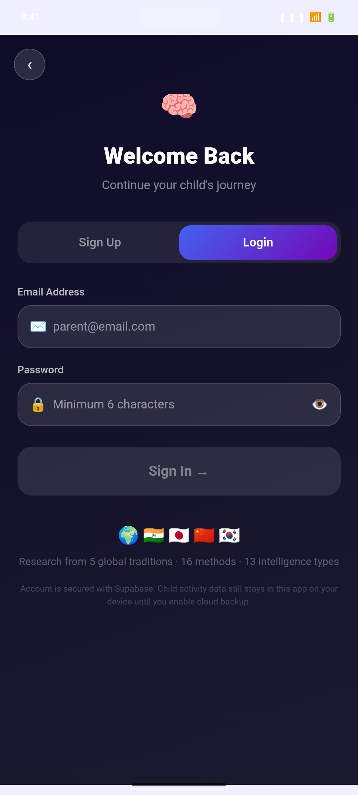
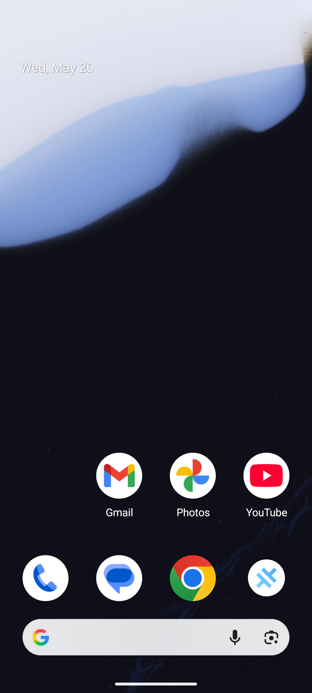
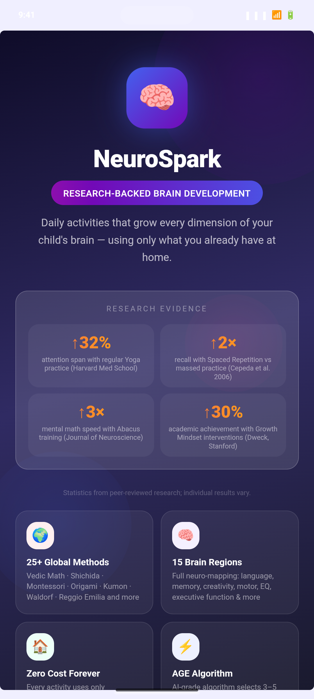

# Dogfood Report: NeuroSpark Android APK

| Field | Value |
|-------|-------|
| **Date** | 2026-05-20 |
| **App URL** | `com.neurospark.app` (Capacitor WebView, v1.0.1 / versionCode 2) |
| **Session** | `apk-emulator-resizable-2026-05-20` |
| **Scope** | Debug APK on Android Emulator (`Resizable_Experimental`, 1080×2400). Landing → auth flows, cold start, offline launch. Post-login/home flows **not tested** (no test credentials). |
| **APK tested** | `android/app/build/outputs/apk/debug/app-debug.apk` (rebuilt after React pin fix) |

## Summary

| Severity | Count |
|----------|-------|
| Critical | 1 |
| High | 1 |
| Medium | 2 |
| Low | 2 |
| **Total** | **6** |

**Ship verdict:** Do **not** upload the previously built release AAB/APK to Play without rebuilding. The bundled web assets had **React 19 + react-dom 18**, which crashes the WebView on launch (blank white screen). A fix was applied during this session (`react`/`react-dom` pinned to 18.3.1); rebuild release artifacts before store submission.

## Issues

### ISSUE-001: App shows blank white screen on launch (React version mismatch)

| Field | Value |
|-------|-------|
| **Severity** | critical |
| **Category** | functional / console |
| **URL** | `https://localhost/` (Capacitor) |
| **Repro Video** | N/A |

**Description**

On cold start, the WebView stays blank (white screen). Logcat shows:

`Uncaught TypeError: Cannot read properties of undefined (reading 'ReactCurrentBatchConfig')` in `vendor-*.js`.

Root cause: `pnpm why react` resolved **react@19.2.6** (via `supabase` → `@effect/atom-react`) while **react-dom@18.3.1** was bundled. React 18 and 19 must not be mixed in the production vendor chunk.

**Fix applied (in repo):** Added direct deps `react@18.3.1` / `react-dom@18.3.1` and pnpm overrides. Rebuilt `app-debug.apk` — landing screen renders correctly.

**Repro Steps**

1. Install APK built **before** the React pin (original dogfood build).
   

2. Launch `com.neurospark.app/.MainActivity` and wait 5s.
   

3. **Observe:** White screen; Capacitor console error `ReactCurrentBatchConfig` in logcat.

4. Reinstall APK **after** fix, clear app data, relaunch.
   

---

### ISSUE-002: Android system Back exits app instead of returning to landing

| Field | Value |
|-------|-------|
| **Severity** | high |
| **Category** | ux / functional |
| **URL** | Auth screen |
| **Repro Video** | N/A |

**Description**

From the auth screen, pressing the device **Back** gesture/key returns to the **Android launcher**, not the in-app landing page. Users expect Back to undo one step within the app. The header back control exists in code (`navigate("landing")`) but system back is not wired (typical Capacitor gap).

**Repro Steps**

1. Open app → scroll to CTAs → tap **Get Started Free**.
   

2. Auth screen appears.
   

3. Press Android **system Back** (KEYCODE_BACK).
   

4. **Observe:** Launcher/home screen, not landing.

---

### ISSUE-003: Cold start jank — skipped frames on main thread

| Field | Value |
|-------|-------|
| **Severity** | medium |
| **Category** | performance |
| **URL** | App launch |
| **Repro Video** | N/A |

**Description**

Logcat reports `Skipped 45 frames` and `Skipped 46 frames` during first paint, plus HWUI `Davey! duration=1498ms` on initial WebView load. First open feels sluggish on emulator; worth profiling bundle size and deferring non-critical work after first paint.

**Repro Steps**

1. `pm clear com.neurospark.app` then cold start.
2. Capture logcat — frame skip warnings appear within first 3s of launch.

---

### ISSUE-004: Release/store artifacts must be rebuilt after React fix

| Field | Value |
|-------|-------|
| **Severity** | medium |
| **Category** | functional |
| **URL** | Build pipeline |
| **Repro Video** | N/A |

**Description**

`app-release.aab` / `app-release-unsigned.apk` produced earlier in the session embed the **broken** vendor bundle. Play Console upload would ship a non-functional app until `pnpm run android:release` is run **after** `package.json` React pins and a full `verify` pass.

---

### ISSUE-005: Fold/multi-display emulator screencap ambiguity

| Field | Value |
|-------|-------|
| **Severity** | low |
| **Category** | visual (testing only) |
| **URL** | N/A |
| **Repro Video** | N/A |

**Description**

On `Resizable_Experimental`, `adb screencap` without `-d <display-id>` warns about multiple displays and can capture a **blank** buffer (~15 KB). Use `adb shell dumpsys SurfaceFlinger --display-id` and `-d` for QA screenshots. Not an end-user bug.

---

### ISSUE-006: Offline banner only after login

| Field | Value |
|-------|-------|
| **Severity** | low |
| **Category** | ux |
| **URL** | Landing (offline) |
| **Repro Video** | N/A |

**Description**

With airplane mode enabled, the **landing page still loads** from bundled assets (good). `OfflineBanner` in `App.tsx` only renders when `isAuthenticated && !isOnline`. Pre-auth users get no offline hint; consider a subtle banner on auth if Supabase calls will fail offline.

**Repro Steps**

1. Enable airplane mode, launch app.
   

2. **Observe:** Landing renders; no offline strip (by design today).

---

## What worked (after React fix)

| Area | Result |
|------|--------|
| Cold start / landing | Renders branding, research cards, age tiers, CTAs |
| Scroll | Smooth vertical scroll on landing |
| CTA → Auth | **Get Started** opens auth (login mode) |
| Auth UI | Sign Up / Login toggle, fields, disabled submit until valid |
| Offline landing | Bundled HTML/JS loads without network |
| Capacitor assets | Local `https://localhost/assets/*` served without JS errors (post-fix) |

## Not tested (blocked)

- Sign up / sign in / onboarding / home / generate / paywall (requires Supabase test account or dev env in build)
- In-app purchases (Play Billing)
- Release-signed AAB install
- Physical device + TalkBack

## Recommended next steps

1. Run `pnpm run verify` then `pnpm run android:release` with production `.env` (`VITE_SUPABASE_*`).
2. ~~Wire Android hardware back~~ — Done via `@capacitor/app` (`App.addListener('backButton')`) calling `goBack()` / auth→landing / `exitApp`.
3. Dogfood again on a **phone** AVD (e.g. Pixel 6): run `pnpm run demo:create-user`, set optional demo login vars in `.env.local`, `pnpm run build:mobile`, install APK — exercise onboarding → home → Today → activity coaching → Brain coach (with AI consent).
4. Add CI check: fail build if `pnpm why react` and `pnpm why react-dom` major versions differ.

## Follow-up implementation (2026-05-20)

- **`pnpm run demo:create-user`** — Creates Supabase Auth user `demo.parent@neurospark.local` (password default `NeuroSparkDemo2026!` or `DEMO_PARENT_PASSWORD`). Needs **`SUPABASE_SERVICE_ROLE_KEY`** in `.env.local`. See **`docs/DEMO_ACCOUNT.md`**.
- **Demo login button** — Shown only when `VITE_SHOW_DEMO_LOGIN=true` plus `VITE_DEMO_LOGIN_EMAIL` / `VITE_DEMO_LOGIN_PASSWORD` (internal QA APK only; credentials are extractable from the bundle).
- **Fireworks AI** — Parent coach content (`POST …/coach`) already prefers Fireworks when Edge secret **`FIREWORKS_API_KEY`** is set; fallback OpenAI or deterministic templates. Details in **`docs/SETUP_CREDENTIALS.md`** and **`supabase/functions/server/ai_provider.ts`**.

Post-login flows were **not** re-run from this workspace (no access to your Supabase service role). After `demo:create-user`, rebuild the APK and continue dogfood using **Demo login** or manual email/password sign-in.

## Evidence paths

- Screenshots: `dogfood-output/screenshots/`
- Report: `dogfood-output/report.md`
- Fix: `package.json` — `react`/`react-dom` 18.3.1 + pnpm overrides
